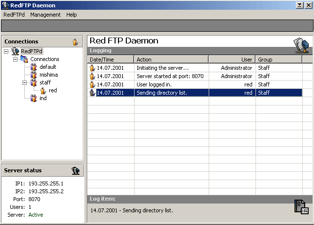



## REDFTP SERVER UPDATE 29/04/2002

### Description

This code is a updated version of REDFTP Server with OCX's. I have Fixed some of the bugs but there is a few still like it wont work in IE5. You can Upload/Download/Add/Rename/Delete. Is there anyone intrested it doing the client for this prog?. RED has put all the commands into the server. RED Nice 1 but why is there no updates???? and Where is your site gone??????
 
### More Info
 

             |
---                |---
**Submitted On**   |2002-04-29 13:08:44
**By**             |[Matthew Bone](https://github.com/Planet-Source-Code/PSCIndex/blob/master/ByAuthor/matthew-bone.md)
**Level**          |Intermediate
**User Rating**    |5.0 (10 globes from 2 users)
**Compatibility**  |VB 6\.0
**Category**       |[Internet/ HTML](https://github.com/Planet-Source-Code/PSCIndex/blob/master/ByCategory/internet-html__1-34.md)
**World**          |[Visual Basic](https://github.com/Planet-Source-Code/PSCIndex/blob/master/ByWorld/visual-basic.md)
**Archive File**   |[REDFTP\_SER770514292002\.zip](https://github.com/Planet-Source-Code/matthew-bone-redftp-server-update-29-04-2002__1-34213/archive/master.zip)

